# ISentry Internship – Frontend Assessment 🚀

A responsive mini-dashboard web application built as part of the **ISentry Frontend Internship Practical Challenge**.

The project demonstrates modern React practices, API integration, CRUD functionality, and user experience enhancements such as theme toggling, prefetching, and notifications.

---

## ✨ Features

- **Responsive Layout**: Sidebar navigation, top navbar with logo/profile/theme toggle, and adaptive main content.
- **Data Management**:
  - Fetches and paginate user data from [JSONPlaceholder](https://jsonplaceholder.typicode.com/).
  - Implements **CRUD** (Create, Read, Update, Delete) operations.
- **Prefetching**: Optimized with **TanStack Query** for smooth data loading.
- **Search Functionality**: Filter users by name.
- **Theme Toggle**: Light/Dark mode support.
- **User Experience**:
  - Toast notifications using **react-hot-toast**.
  - Forms with **react-hook-form** for validation and handling.
  - Icons via **react-icons**.
  - Smooth modal/details view for user info.
  - **Dummy Profile Images** via [UI Avatars API](https://ui-avatars.com/).

---

## 🛠️ Tech Stack

- **React.js** – Core framework
- **Tailwind CSS** – Utility-first styling
- **TanStack Query** – Data fetching, caching, and mutations
- **React Hook Form** – Form handling and validation
- **React Hot Toast** – Notifications
- **React Icons** – Iconography
- **JSONPlaceholder API** – Mock backend for users/posts
- **UI Avatars API** – Placeholder profile images

---

## 📸 Screenshots

### Dashboard View (PC & Mobile Dark Mode)

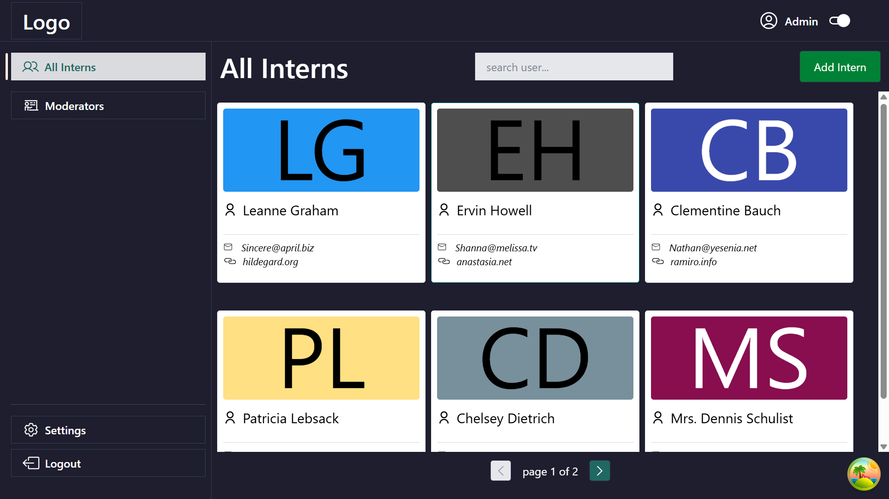
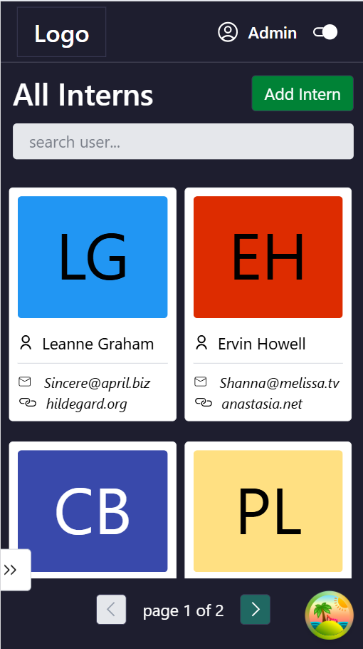
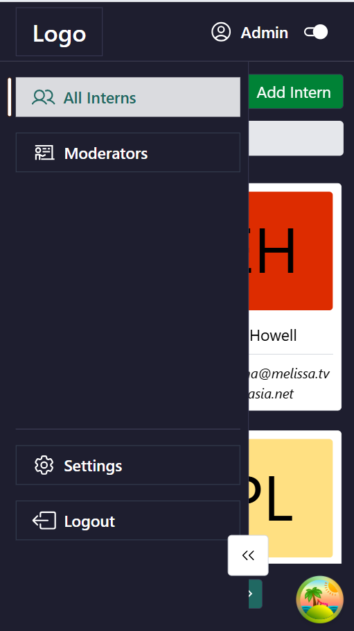

### Dashboard View (PC & Mobile Light Mode)

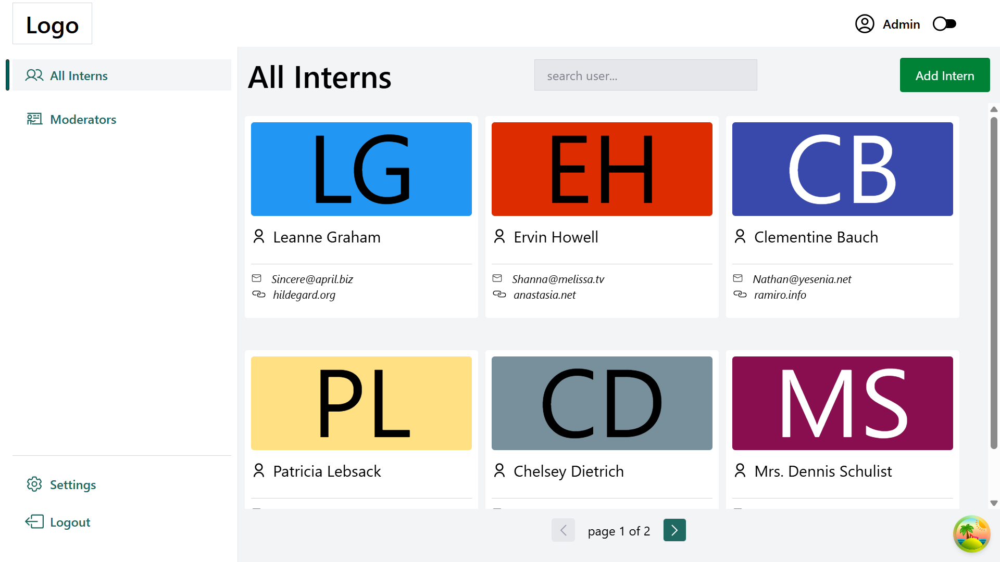  
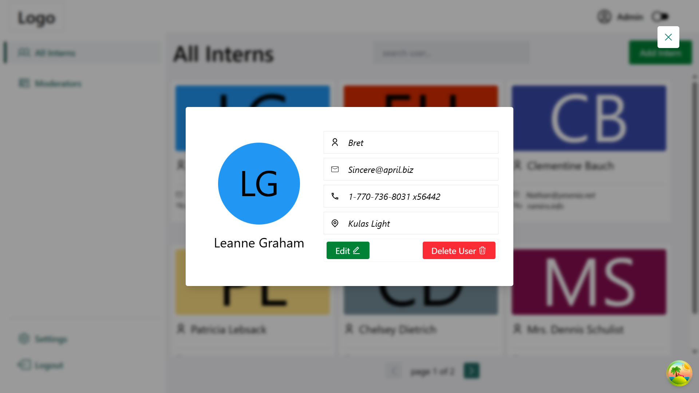  
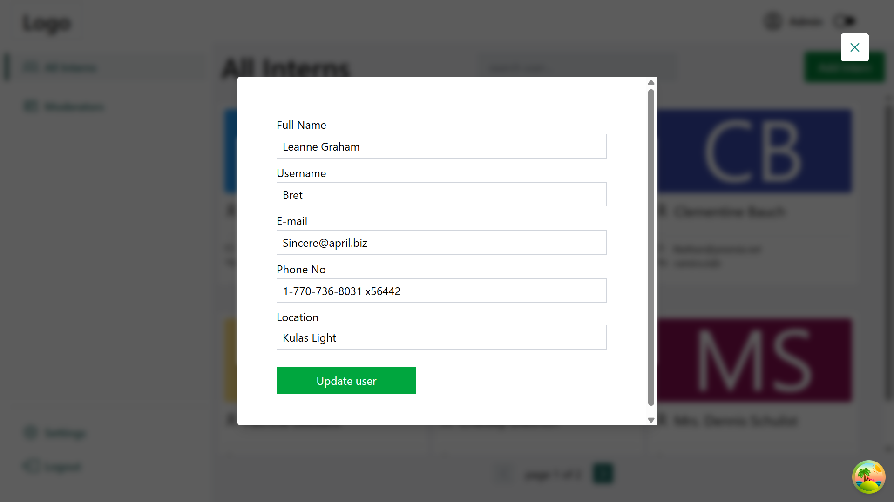  
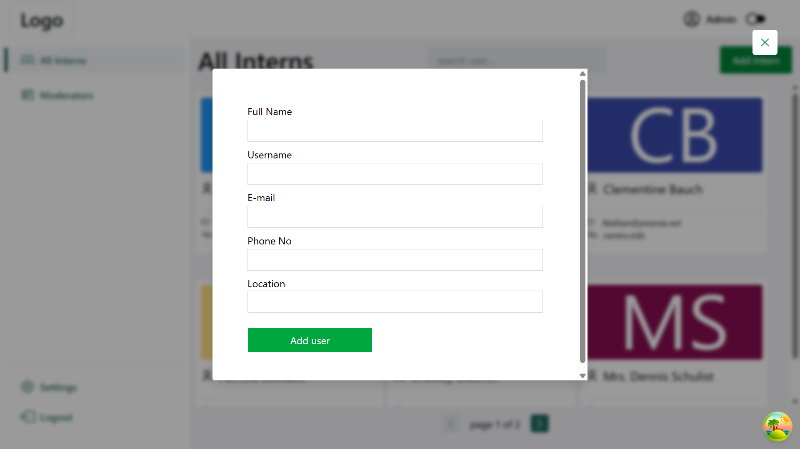
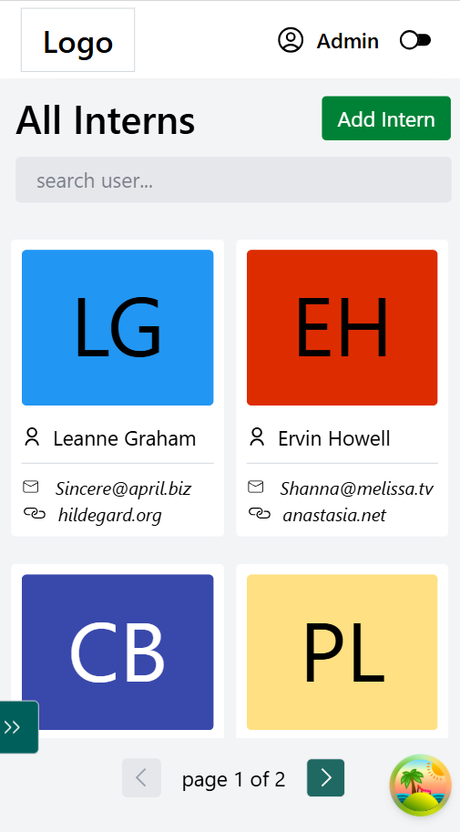  
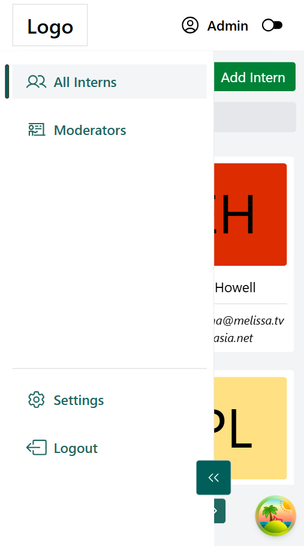  
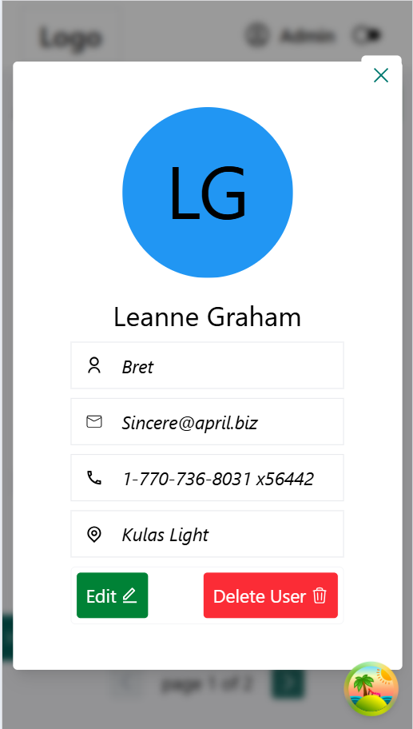  
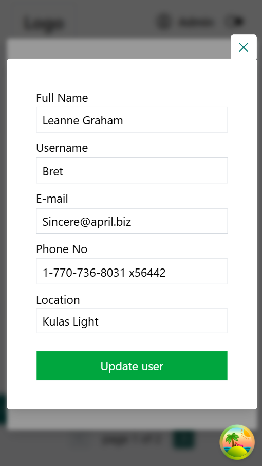

---

## ⚡ Getting Started

### Prerequisites

- Node.js (v16+)
- npm or yarn

### Installation

```bash
# Clone the repo
git clone https://github.com/Asa-Steve/dashboard.git

# Install dependencies
npm install

# Run development server
npm run dev
```

---

## 🌍 Live Demo

Deployed on [Vercel](https://dashboard-plum-chi.vercel.app/interns).

---

## 🚀 Future Improvements

- Enhance error handling for API requests.
- Improve accessibility (ARIA roles, keyboard navigation).
- Add animations for smoother transitions.

---

## 📌 Assessment Reference

This project was built following the **ISentry Internship – Frontend Assessment** requirements.
